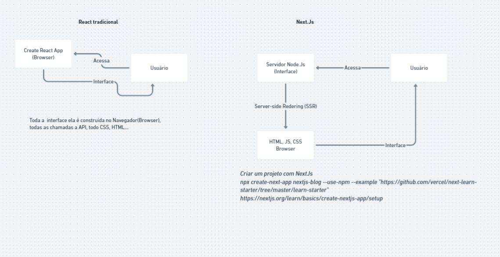

# Curso [NextJS](https://nextjs.org/) - Rocketseat

> Curso de NextJS e Prismic da Rocketseat com 

## Fundamentos
---

### Iniciando o Projeto com Typescript

- Criação do app com NextJS

```bash
npx create-next-app NOME_DO_PEROJETO
```

- Utilizando Typescript, criar um arquivo `tsconfig.json`

```bash
touch tsconfig.json
npm install --save-dev typescript @types/react @types/node
```

Renomear os arquivos para a extensão `.tsx`

- Iniciar o app com

```
npm run dev
```

A aplicação web é executada no endereço: `localhost:3000`

- Produção no Vercel

Rodar o `npm run build`

No Vercel

```bash
npm i -g vercel #caso não tenha instalado globalmente o vercel na máquina
vercel login
vercel
```

- Deploy no Vercel

https://nextjs-curso-1vos6s908-gabrieljony.vercel.app/

---

### Páginas e rotas
Para criar uma página com rota basta apenas criar um arquivo na pasta "pages", caso não seja uma página e não tenha rota escrever o arquivo com início de _ Ex. "_app.tsx"

- Criar arquivo `_document.js` na pasta pages, [clique aqui](https://github.com/vercel/next.js/blob/master/examples/with-styled-components/pages/_document.js).

#### Rotas

##### Buscar por camiseta:
- http://localhost:3000/search?q=camiseta

---
### Servidor Fake usando o `json-fake`

```bash
npx json-server server-fake.json -p 3333 -w
```

Foi usado no inicio o servidor Fake mas depois substituimos pelo CMS do Prismic.

---
### CMS disponíveis no mercado
- ghost.org ideal para blog
- strapi.io painel de admin com a interface
- prismic.io para site, website - o que usamos nessa aplicação.
- contentful

#### [Prismic.io](https://prismic.io/dashboard)
- Repositório do projeto https://frontcommerce.prismic.io/documents/

---
### SEO
Criado um component `SEO.tsx` para poder incluir tags (meta e title) no head do html.

NextJS ajuda muito com o recurso: next/head que inclui o conteudo no head da página, independente de onde colocamos o na página.

```typescript
<SEO 
        title="DevCommerce, your best ecommerce!"
        image="boost.png"
        shouldExcludeTitleSuffix/>

```
---

### Comandos GIT

- Voltar o commit específico?
```
git reset --hard {hash-do-commit-desejado}
```

## [Diagrama Bootcamp NextJs](https://whimsical.com/bootcamp-nextjs-FXePHnTwE3xJpWwreD4yRN)



